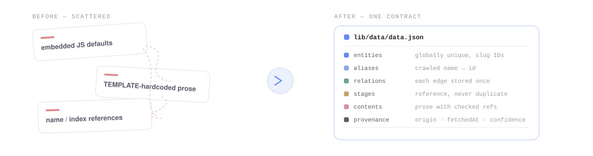
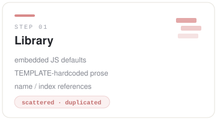
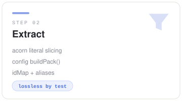
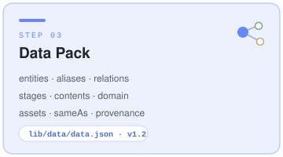
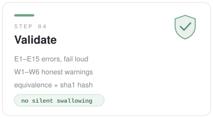
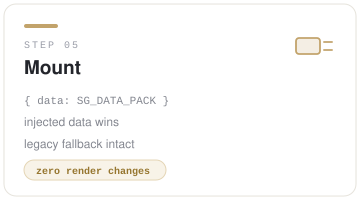
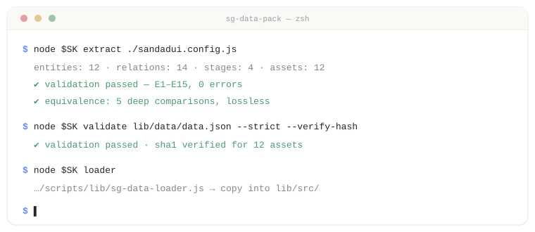
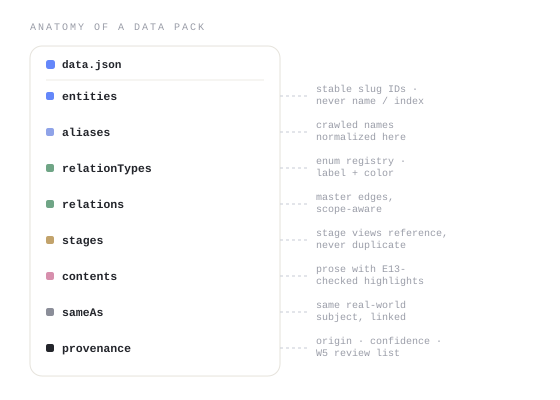

<div align="center">



<h3>One contract for every component library's data —<br/>extracted, validated, reviewed, and explained.</h3>

<p>
  <a href="https://github.com/SuTang-vain/sg-data-pack/blob/main/SKILL.md"></a>
  
  
  
  <a href="https://github.com/SuTang-vain/sg-data-pack/blob/main/LICENSE"></a>
</p>

</div>

---

## What is it?



Component libraries generated from HTML case pages scatter business data everywhere —
embedded JS defaults, template-hardcoded prose, name/index-based references, per-stage
duplicated copies. When re-fetching data, this produces **crawl errors that pass silently**
and **relationships that quietly tangle**.

sg-data-pack turns that chaos into a single **Data Pack** — one `data.json` with globally
unique entities, ID-only references, reference-instead-of-duplicate stages, and record-level
provenance — then patches the library engine to prefer injected data, with a **losslessness
guarantee** proven by deep-equivalence testing.

The product-facing entry point is `report`: it turns validation, library rules, extraction,
diff, recrawl review, and Candidate audit into one deterministic **Library Evolution Report**.
Instead of making users assemble several command outputs, it explains what was found, what
changed, what was actually verified, what remains risky, and what developers should do next.

<table>
<tr>
<td width="33%" valign="top">

### 🧊 Single source of truth
All business data lives in `lib/data/data.json`. Embedded defaults become fallback only — crawl output has exactly one place to land.

</td>
<td width="33%" valign="top">

### 🔗 Reference, never duplicate
Entities are keyed by stable slug IDs; crawled names normalize through `aliases`; master edges are stored once and stages reference them via `{a,b}`.

</td>
<td width="33%" valign="top">

### 🚨 Fail loudly, never silently
`SGDataLoader` validates on mount — **E1–E16** errors throw, **W1–W8** warnings are reported honestly. Dangling refs, illegal enums, and invalid derivation source paths explode at load time.

</td>
</tr>
<tr>
<td width="33%" valign="top">

### 🧬 Record-level provenance
Entity / relation / content records can be traced in the parallel `provenance` section. Missing origin/source metadata is surfaced by W7/W8; below-threshold confidence goes to a review list (W5).

</td>
<td width="33%" valign="top">

### 🧪 Scoped equivalence by construction
Every extracted literal must be mapped to `__fromPack(pack)` or explicitly ignored with evidence. The configured surface deep-equals engine defaults; runtime/visual behavior needs separate evidence.

</td>
<td width="33%" valign="top">

### 🤖 Agent-native skill
Works as a **Codex / Claude Code / ZCode** skill plus a zero-dependency Node CLI. The workflow is encoded in `SKILL.md`; agents follow it end-to-end.

</td>
</tr>
</table>

---

## The Pipeline



### 01 · Library — where the chaos lives

Every component library starts with business data scattered across embedded JS
defaults, TEMPLATE-hardcoded prose, and name/index-based references. The first
pass is a survey: which collections are options-overridable, which are hardcoded,
and how entities reference each other.

<br clear="all"/>



### 02 · Extract — normalize without losing a byte

The CLI slices default-data literals straight from the engine source with acorn as a
**bootstrap baseline**, then your config's `buildPack()` normalizes them: entities get stable slug IDs,
crawled names become `aliases`, per-stage duplicated copies collapse into
`{a,b}` references, and prose lifts out of templates into `contents`.

<br clear="all"/>



### 03 · Data Pack — one file to rule the data

Everything lands in `lib/data/data.json`: entities, aliases, relation registry,
master edges, stage views, long-form contents, library-specific domain data,
an asset manifest with sha1, entity-identity `sameAs`, and record-level
`provenance` and declarative `derivations`. Formal contract: JSON Schema v1.3.

<br clear="all"/>



### 04 · Validate — fail loud, never silently

`SGDataLoader` checks **E1–E16** on mount (dangling refs, illegal enums,
coordinate range, asset registration, scope disambiguation, derivation paths…) and reports
**W1–W8** honestly. Equivalence proves only the configured literal mappings; coverage is explicit.
`--compare-existing` catches output drift and `--verify-hash` catches replaced assets.

<br clear="all"/>



### 05 · Mount — injected data wins

The engine prefers the injected pack through `__resolveDataOptions` — pack data
is converted to the legacy options shape and flows through the original code
paths. Zero rendering changes, and the embedded fallback stays intact when no
pack is provided.

<br clear="all"/>

### 06 · Report — turn evidence into an engineering hand-off

The `report` command is the product layer on top of the pipeline. It aggregates the existing
facts from validation, library rules, extraction/equivalence, structural diff, recrawl review,
and Candidate audit into one deterministic **Library Evolution Report**. It does not invent
new business facts or silently apply crawl observations.

```text
Data Pack + evidence
  → findings        what may be wrong
  → changes         what was modified or completed
  → assurances      what actually passed
  → risks           what remains unverified or exposed
  → next steps      who should do what, and when it is done
```

The human output is deliberately fixed to five sections: **发现的问题**, **已修改 / 已完善**,
**验证范围**, **剩余风险**, and **下一步**. The JSON and Markdown files are projections of the
same RunReport object, so counts and conclusions cannot drift between CI and developer views.

### 07 · Agent evaluation — test modifications, not just data

The next layer asks a stricter question: can an AI use these contracts to make a correct component-
library change? An `AgentTaskManifest` binds instructions, source/input trees, allowed/forbidden
files, patch limits, grader bytes and runtime/visual evidence requirements. “Hidden” means omitted from the prompt and candidate workspace, not secret from a malicious host process without an OS sandbox. The agent emits a patch only; the runner applies it in a disposable workspace, rechecks the complete tree diff (including `.git/**`), runs task-specific graders from digest-verified per-trial staging copies, and records every artifact digest in TaskRun.

```text
AgentTaskManifest
  → patch-only agent
  → preflight + exact apply + postflight file policy
  → Data Pack / hidden / command graders
  → runtime + visual evidence
  → TaskRun → repeated ExperimentReport
```

`research/agent-eval/` contains a three-task benchmark and scripted/real-provider experiment specs.
A scripted run proves the harness only. A real-provider success rate is reported with its valid trial denominator, Wilson 95% interval, actual provider model metadata, tokens, cost, and failure taxonomy. Candidate timeout/crash/evidence failure and post-agent integrity drift remain valid failures; only verified pre-subject infrastructure failures are excluded. It is not generalized into a claim about arbitrary production libraries. TaskRun explicitly records that the portable runner has no OS, network, process, or malicious-agent grader-secrecy sandbox.

---

## Environment handoff / 环境交接

Start with [`HANDOFF.md`](HANDOFF.md) when moving to another machine or handing this repository to a new maintainer. It describes the handoff tag, directory ownership, offline acceptance, optional dependencies, and known limits.

```bash
node scripts/verify-handoff.js
```

This checks the full test suite, frozen experiment artifacts and deterministic pilots without running an AI provider or a live browser experiment.

## Quick Start

```bash
git clone https://github.com/SuTang-vain/sg-data-pack.git

# symlink into your agent's skills directory (pick one):
ln -s "$PWD/sg-data-pack" ~/.zcode/skills/sg-data-pack    # ZCode
ln -s "$PWD/sg-data-pack" ~/.codex/skills/sg-data-pack    # Codex
ln -s "$PWD/sg-data-pack" ~/.claude/skills/sg-data-pack   # Claude Code
```

### CLI



```bash
SK=~/.zcode/skills/sg-data-pack/scripts/sg-data-pack

node "$SK" extract <path/to/config.js>                 # bootstrap from source literals; refuses divergent existing data.json
node "$SK" extract <path/to/config.js> --check         # source-equivalence only; does not read current data.json
node "$SK" extract <path/to/config.js> --compare-existing  # compare fresh pack with current data.json
node "$SK" compile <data.json> [--domain-schema fragment.json] [--check]  # reviewed data.json -> data.js + schema; explicit custom domain contract
node "$SK" validate <data.json> --strict --verify-hash [--asset-root dir]
node "$SK" rules <libDir> [--strict] [--rule id]
node "$SK" diff <old.json> <new.json> [--json]
node "$SK" templatize <instances.json> [--out dir]
node "$SK" alias-candidates <data.json> <names.json|txt>
node "$SK" recrawl-skeleton <data.json> <records.json> [--out dir]
node "$SK" recrawl-skeleton <data.json> <records.json> --candidate-ready --origin crawl:site --source https://example.test/source --fetchedAt 2026-07-31 --out review/
node "$SK" data-surface-import <ui-dismantler-manifest.json> [--out report.json] [--allow-review-required]
node "$SK" candidate <data.json> review/review-report.json review/decisions.json --records records.json --out candidate.json --audit candidate-audit.json
node "$SK" report <libDir> [--config extract.config.js] [--baseline old-data.json] \
  [--review review-report.json] [--audit candidate-audit.json] [--strict] \
  [--verify-hash] [--out report/] [--json]
node "$SK" types <data.json> [--out data-types.d.ts] [--name PackName]
node "$SK" task validate <task.json> [--json]
node "$SK" task run <task.json> --agent-command <exe> --agent-arg '<arg>' --artifacts <dir> [--json]
node "$SK" grade <grader.json> <workspace> [--artifacts dir] [--json]
node "$SK" evidence <runtime|visual> <evidence.json> [--json]
node "$SK" experiment <experiment.json> --out <dir> [--json]
node "$SK" loader    # print runtime-validator path (copy into a library's lib/src/)
node "$SK" schema    # print contract-schema path
```

> `data-surface-import` is a read-only handoff from `ui-dismantler`. It accepts component data interfaces and review evidence; it does not normalize business entities or create `data.json`. A review-required report exits non-zero unless `--allow-review-required` is supplied for audit-only output.

> Zero dependencies (acorn is vendored). Requires **Node ≥ 18**.

### Recommended product workflow

```bash
# 1. Bootstrap the canonical pack once; later detect, do not overwrite, reviewed evolution
node "$SK" extract path/to/extract.config.js
node "$SK" extract path/to/extract.config.js --compare-existing

# 2. After reviewing/editing data.json, regenerate browser/schema artifacts from that canonical source
node "$SK" compile path/to/library/lib/data/data.json

# 3. Produce one human + CI hand-off
node "$SK" report path/to/library \
  --config path/to/extract.config.js \
  --verify-hash \
  --out report/

# 4. For evolution or recrawl work, bind the related evidence
node "$SK" report path/to/library \
  --baseline old-data.json \
  --review review/review-report.json \
  --audit candidate-audit.json \
  --strict --json > report.json
```

`data-surface-import` is the read-only handoff from `ui-dismantler`: it consumes a Data Surface Manifest,
keeps unresolved/review evidence auditable, and never creates `data.json`. Review-required manifests
remain blocked unless `--allow-review-required` is explicitly used for audit-only output.

`--out report/` writes `report.json` and `REPORT.md` without modifying the library source.
`--json` writes exactly one RunReport JSON object to stdout; collector progress is kept on stderr.
The report never treats `NOT_ASSESSED` as a pass.

### Report outcomes and exit codes

| Outcome | Meaning | Exit code |
|---|---|---:|
| `ready` | No blocking finding in the supplied evidence | `0` |
| `issues-found` | Non-blocking warnings remain | `0` |
| `review-required` | Gap, conflict, miss, or unsupported item still needs a decision | `1` |
| `blocked` | Validation, rules, equivalence, or asset integrity gate failed | `1` |
| `input-error` | Argument, JSON, digest, or evidence input is invalid | `2` |

`--strict` promotes validation, rules, extraction, and Candidate warnings to blocking failures.
For the full RunReport contract, including maturity, assurance statuses, residual risks, and
source immutability, see [`references/run-report-contract.md`](references/run-report-contract.md).

---

## The Data Pack (v1.3)

<table>
<tr>
<td width="54%" valign="top">

```jsonc
{
  "schemaVersion": "1.3",
  "meta": { "id": "journey", "title": "Journey",
            "hero": "wukong" },
  "entities": {
    "wukong": { "name": "孙悟空", "kind": "person" },
    "rulaifo": { "name": "如来佛祖", "kind": "person" }
  },
  "aliases": { "孙悟空": "wukong" },
  "relationTypes": {
    "enemy": { "label": "敌对" }
  },
  "relations": [{ "id": "wuxingshan",
    "a": "rulaifo", "b": "wukong", "type": "enemy",
    "label": "五行山压", "scope": ["tianting"] }],
  "stages": [{ "key": "tianting", "name": "大闹天宫",
    "entities": ["wukong", "rulaifo"],
    "relations": [
      { "id": "wuxingshan", "a": "rulaifo", "b": "wukong" }
    ] }],
  "provenance": { "entities": {
    "wukong": { "origin": "engine-embedded-defaults",
                 "fetchedAt": "2026-07-30", "confidence": 1.0 }
  } }
}
```

</td>
<td width="46%" valign="top">



</td>
</tr>
</table>

### Rule cheat sheet

| | |
|---|---|
| **E5 / E7** | Dangling references (after alias normalization) — *crawled-name mismatches explode here* |
| **E6 / E10** | Unregistered relationship enums / attribute labels |
| **E11** | Local assets referenced but missing from the manifest |
| **E12** | Multi-edge pairs must be disambiguated by `scope` |
| **E13** | Prose highlights referencing unknown entities — *wrong names in text are caught* |
| **W5 / W6** | Low-confidence records for review · suspected duplicate entities |

Full contract: [`references/data-pack-contract.md`](references/data-pack-contract.md). The explicit recrawl review loop is documented in [`references/review-candidate-contract.md`](references/review-candidate-contract.md): candidates are never applied without human decisions and a strict validation gate. The unified product-facing output is documented in [`references/run-report-contract.md`](references/run-report-contract.md): it explains discovered problems, changes, verification coverage, residual risks, and next steps.

---

## Documentation

| File | Contents |
|---|---|
| [`SKILL.md`](SKILL.md) | Agent workflow + rules (loaded by Codex / Claude Code / ZCode) |
| [`references/data-pack-contract.md`](references/data-pack-contract.md) | Data Pack v1.3 field-level contract |
| [`references/review-candidate-contract.md`](references/review-candidate-contract.md) | Candidate-ready recrawl reports, explicit decisions, and audit contract |
| [`references/run-report-contract.md`](references/run-report-contract.md) | Unified Library Evolution Report, coverage, risks, and exit codes |
| [`references/agent-task-contract.md`](references/agent-task-contract.md) | Content-bound task, source/input, file-policy and grader contract |
| [`references/patch-execution-contract.md`](references/patch-execution-contract.md) | Patch-only execution, postflight file enforcement and PatchAudit |
| [`references/grader-contract.md`](references/grader-contract.md) | Task-specific checks, score and GradeReport |
| [`references/task-run-contract.md`](references/task-run-contract.md) | One agent execution and artifact audit |
| [`references/runtime-visual-evidence-contract.md`](references/runtime-visual-evidence-contract.md) | Runtime/visual producer evidence and recomputed gates |
| [`references/agent-experiment-contract.md`](references/agent-experiment-contract.md) | Repeated TaskRuns, success rate, Wilson interval and failure taxonomy |
| [`references/extraction-config.md`](references/extraction-config.md) | Config guide + three real-world patterns |
| [`references/engine-integration.md`](references/engine-integration.md) | Engine-patch standard template |
| [`assets/extract.config.template.js`](assets/extract.config.template.js) | Annotated config template for a new library |

## Tests

Zero-dependency contract tests cover the loader rules (E1–E16 / W1–W8), the diff impact tracker,
the TypeScript generator, and cross-artifact version consistency:

```bash
node --test tests/*.test.js
```

The same suite runs in CI via `.github/workflows/smoke.yml`. Three reproducible v1.3 synthetic pilots and their machine-readable result live under `research/`; rerun them with `node research/run-v1.3-pilots.js`. The suite also contains a hermetic real-engine integration fixture for the Qinshihuang event graph at `tests/fixtures/integration/qinshihuang-0716-ts/`, covering external HTML JSON extraction, configured equivalence, committed asset baselines plus tamper detection, library rules, generated types, and real derivation impact.

Agent evaluation fixtures live under `research/agent-eval/`: three content-bound tasks, hidden graders,
patch-only providers, a real headless-Chrome/Pillow evidence producer, and scripted/AI experiment specs.
Regenerate their task/experiment ids with `node research/agent-eval/build-fixtures.js`. Committed result
reports state their narrow benchmark scope and preserve failures rather than presenting a green test
suite as proof of general AI capability.

## License

[MIT](LICENSE)
