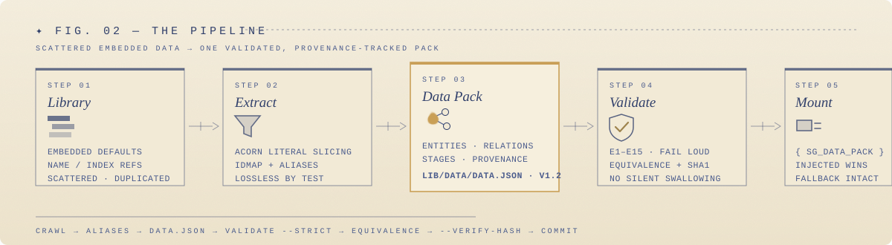

<div align="center">


<h3>One schema for every component library's data —<br/>extracted, validated, and provenance-tracked.</h3>

<p>
  <a href="https://github.com/SuTang-vain/sg-data-pack/blob/main/SKILL.md"></a>
  
  
  
  <a href="https://github.com/SuTang-vain/sg-data-pack/blob/main/LICENSE"></a>
</p>

</div>

---

## Why sg-data-pack?

Component libraries generated from HTML case pages scatter business data everywhere —
embedded JS defaults, template-hardcoded prose, name/index-based references, per-stage
duplicated copies. When re-fetching data, this produces **crawl errors that pass silently**
and **relationships that quietly tangle**.

sg-data-pack turns that chaos into a single **Data Pack** — one `data.json` with globally
unique entities, ID-only references, reference-instead-of-duplicate stages, and record-level
provenance — then patches the library engine to prefer injected data, with a **losslessness
guarantee** proven by deep-equivalence testing.

<table>
<tr>
<td width="33%" valign="top">

### 🧊 Single source of truth
All business data lives in `lib/data/data.json`. Embedded defaults become fallback only — crawl output has exactly one place to land.

</td>
<td width="33%" valign="top">

### 🔗 Reference, never duplicate
Entities are keyed by stable slug IDs; crawled names normalize through `aliases`; master edges are stored once and stages reference them via `{a,b}`.

</td>
<td width="33%" valign="top">

### 🚨 Fail loudly, never silently
`SGDataLoader` validates on mount — **E1–E15** errors throw, **W1–W6** warnings are reported honestly. Dangling refs and illegal enums explode at load time.

</td>
</tr>
<tr>
<td width="33%" valign="top">

### 🧬 Record-level provenance
Every entity / relation / content block carries `origin`, `sourceUrl`, `fetchedAt`, `confidence`. Below-threshold records go to a review list (W5).

</td>
<td width="33%" valign="top">

### 🧪 Lossless by construction
`__fromPack(pack)` must deep-equal the engine's embedded defaults — extraction bugs surface as path-level diffs, not production surprises.

</td>
<td width="33%" valign="top">

### 🤖 Agent-native skill
Works as a **Codex / Claude Code / ZCode** skill plus a zero-dependency Node CLI. The workflow is encoded in `SKILL.md`; agents follow it end-to-end.

</td>
</tr>
</table>

---

## The Pipeline



---

## Quick Start

```bash
git clone https://github.com/SuTang-vain/sg-data-pack.git

# symlink into your agent's skills directory (pick one):
ln -s "$PWD/sg-data-pack" ~/.zcode/skills/sg-data-pack    # ZCode
ln -s "$PWD/sg-data-pack" ~/.codex/skills/sg-data-pack    # Codex
ln -s "$PWD/sg-data-pack" ~/.claude/skills/sg-data-pack   # Claude Code
```

### CLI

```bash
SKILL=~/.zcode/skills/sg-data-pack/scripts/sg-data-pack

node $SK extract <path/to/config.js>          # extract + validate + equivalence test
node $SK extract <path/to/config.js> --check  # validate only (regression)
node $SK validate <data.json> --strict --verify-hash
node $SK loader    # print runtime-validator path (copy into a library's lib/src/)
node $SK schema    # print contract-schema path
```

> Zero dependencies (acorn is vendored). Requires **Node ≥ 18**.

---

## The Data Pack (v1.2)

```jsonc
{
  "schemaVersion": "1.2",
  "meta":       { "id": "…", "title": "…", "hero": "…", "assetBase": "../assets/" },
  "entities":   { "wukong": { "name": "孙悟空", "kind": "person", … } },
  "aliases":    { "孙悟空": "wukong" },              // crawled name → id
  "relations":  [{ "a": "rulaifo", "b": "wukong", "type": "enemy",
                   "label": "五行山压", "scope": ["tianting"] }],
  "stages":     [{ "key": "tianting", "entities": ["wukong"],
                   "relations": [{ "a": "rulaifo", "b": "wukong" }],
                   "overlay": { "wukong": { "desc": "…" } } }],
  "contents":   { "timeline-2016": { "kind": "timeline-item", "body": "…",
                   "highlights": [{ "text": "白月光", "ref": "baiyueguang" }] } },
  "sameAs":     [["yingzheng", "qinshihuang"]],      // same real-world subject
  "provenance": { "entities": { "wukong": { "origin": "…", "confidence": 1.0 } } }
}
```

### Rule cheat sheet

| | |
|---|---|
| **E5 / E7** | Dangling references (after alias normalization) — *crawled-name mismatches explode here* |
| **E6 / E10** | Unregistered relationship enums / attribute labels |
| **E11** | Local assets referenced but missing from the manifest |
| **E12** | Multi-edge pairs must be disambiguated by `scope` |
| **E13** | Prose highlights referencing unknown entities — *wrong names in text are caught* |
| **W5 / W6** | Low-confidence records for review · suspected duplicate entities |

Full contract: [`references/data-pack-contract.md`](references/data-pack-contract.md)

---

## Documentation

| File | Contents |
|---|---|
| [`SKILL.md`](SKILL.md) | Agent workflow + rules (loaded by Codex / Claude Code / ZCode) |
| [`references/data-pack-contract.md`](references/data-pack-contract.md) | Data Pack v1.2 field-level contract |
| [`references/extraction-config.md`](references/extraction-config.md) | Config guide + three real-world patterns |
| [`references/engine-integration.md`](references/engine-integration.md) | Engine-patch standard template |
| [`assets/extract.config.template.js`](assets/extract.config.template.js) | Annotated config template for a new library |

## License

[MIT](LICENSE)
